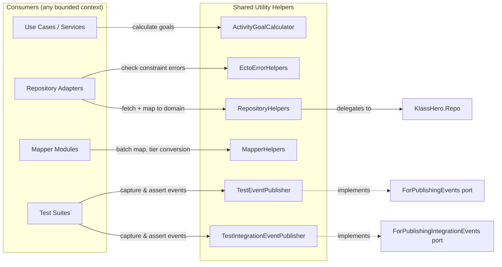

# Feature: Utility Helpers

> **Context:** Shared | **Status:** Active
> **Last verified:** 17f796f3

## Purpose

Reusable infrastructure modules shared across all bounded contexts, providing activity goal calculations, Ecto error introspection, persistence mapping/fetching boilerplate, and process-isolated test doubles for event publishing.

## What It Does

- **ActivityGoalCalculator** -- computes weekly activity progress for a family: current session count, configurable target, capped percentage, and a three-tier status (`:in_progress`, `:almost_there`, `:achieved`)
- **EctoErrorHelpers** -- inspects changeset error tuples to detect unique-constraint, foreign-key, and generic constraint violations without coupling callers to Ecto internals
- **MapperHelpers** -- batch `to_domain` conversion, safe subscription-tier atom/string round-tripping, and optional id injection into attribute maps
- **RepositoryHelpers** -- fetch-by-id-and-map-to-domain one-liner that every repository adapter can delegate to
- **TestEventPublisher** -- `ForPublishingEvents` test double that captures domain events in the process dictionary for assertion
- **TestIntegrationEventPublisher** -- `ForPublishingIntegrationEvents` test double that captures integration events and supports configurable publish failures

## What It Does NOT Do

| Out of Scope | Handled By |
|---|---|
| Domain business logic or validation rules | Individual bounded contexts |
| Actual event delivery (PubSub, Kafka, etc.) | Production event publisher adapters |
| Database schema definitions or migrations | Context-specific persistence adapters |
| Subscription tier business rules | `KlassHero.Shared.SubscriptionTiers` / `Entitlements` context |

## Business Rules

```
GIVEN a list of children with session data
WHEN  ActivityGoalCalculator.calculate/2 is called with no options
THEN  weekly target defaults to 5 sessions
```

```
GIVEN a list of children with session data
WHEN  the calculated percentage exceeds 100%
THEN  percentage is capped at 100
```

```
GIVEN a calculated percentage
WHEN  percentage >= 100
THEN  status is :achieved
```

```
GIVEN a calculated percentage
WHEN  percentage >= 80 and < 100
THEN  status is :almost_there
```

```
GIVEN a calculated percentage
WHEN  percentage < 80
THEN  status is :in_progress
```

```
GIVEN a target of 0 (or negative)
WHEN  percentage is calculated
THEN  result is 0 (division by zero is avoided)
```

```
GIVEN a test process that has called TestEventPublisher.setup/0
WHEN  domain events are published during that test
THEN  events are collected only in that process's dictionary (concurrent-safe)
```

```
GIVEN a test process that has called TestIntegrationEventPublisher.configure_publish_error/1
WHEN  an integration event is published
THEN  publish/1 returns {:error, reason} and the event is NOT stored
```

```
GIVEN a tier string from the database
WHEN  MapperHelpers.string_to_tier/2 converts it
THEN  the atom is returned only if it exists AND is in the allowed tier list; otherwise the default is returned
```

## How It Works



### ActivityGoalCalculator

Accepts a list of child structs and an optional `:target` keyword. Sums session counts from each child (supporting both list and `"current/total"` string formats), divides by target with integer arithmetic, caps at 100%, and maps the percentage to a status atom.

### EctoErrorHelpers

Operates on the raw `errors` list from an `Ecto.Changeset` (format `[{field, {message, opts}}]`). Pattern-matches on the `:constraint` option in opts to identify `:unique` and `:foreign` violations. Provides both field-specific and any-field variants.

### MapperHelpers

- `to_domain_list/2` -- maps a list of Ecto schemas to domain structs via a given mapper module
- `string_to_tier/2` / `tier_to_string/2` -- safe atom/string round-trip for subscription tiers, guarded against atom table exhaustion via `String.to_existing_atom/1` and an allow-list from `SubscriptionTiers`
- `normalize_subscription_tier/1` -- converts `:subscription_tier` in an attrs map from atom to string for persistence
- `maybe_add_id/2` -- conditionally injects `:id` into an attrs map

### RepositoryHelpers

`get_by_id/3` wraps the common `Repo.get` + `nil` check + `mapper.to_domain/1` pattern, returning `{:ok, domain_struct}` or `{:error, :not_found}`.

### TestEventPublisher / TestIntegrationEventPublisher

Both use the process dictionary (`Process.put/get`) keyed by a module-specific atom. `setup/0` initializes an empty list; `publish/1` appends events; `get_events/0` returns the collected list. The integration variant adds `configure_publish_error/1` to simulate publish failures. Process-dictionary isolation makes them safe for `async: true` test execution.

## Dependencies

| Direction | Context | What |
|---|---|---|
| Requires | `Ecto` / `KlassHero.Repo` | RepositoryHelpers delegates fetching to the Repo |
| Requires | `KlassHero.Shared.SubscriptionTiers` | MapperHelpers uses the tier allow-list |
| Requires | `KlassHero.Shared.Domain.Ports.ForPublishingEvents` | TestEventPublisher implements this behaviour |
| Requires | `KlassHero.Shared.Domain.Ports.ForPublishingIntegrationEvents` | TestIntegrationEventPublisher implements this behaviour |
| Provides to | All bounded contexts | Shared persistence, mapping, error detection, and test utilities |

## Edge Cases

- **Division by zero in goal calculator** -- when `target` is 0 or negative, `calculate_percentage/2` returns 0 instead of raising
- **Child with no session data** -- `extract_session_count/1` falls back to 0 for structs lacking a `:sessions` field
- **Malformed session string** -- strings not matching `"N/M"` format or with non-integer current values return 0
- **Empty changeset error list** -- all `EctoErrorHelpers` functions return `false` on an empty list (no match via `Enum.any?`)
- **Unknown tier string** -- `string_to_tier/2` rescues `ArgumentError` from `String.to_existing_atom/1` and returns the default
- **TestEventPublisher without setup** -- `get_events/0` returns `[]` (default) rather than crashing if `setup/0` was never called
- **Appending to events list** -- both test publishers use `events ++ [event]` (O(n) append); acceptable because test event lists are small

## Roles & Permissions

| Role | Can Do | Cannot Do |
|---|---|---|
| Infrastructure | These are infrastructure utilities with no role or permission gating. They operate within whatever authorization boundary the calling context enforces. | N/A |

---

*Generated from code. Sections marked `[NEEDS INPUT]` require manual review.*
