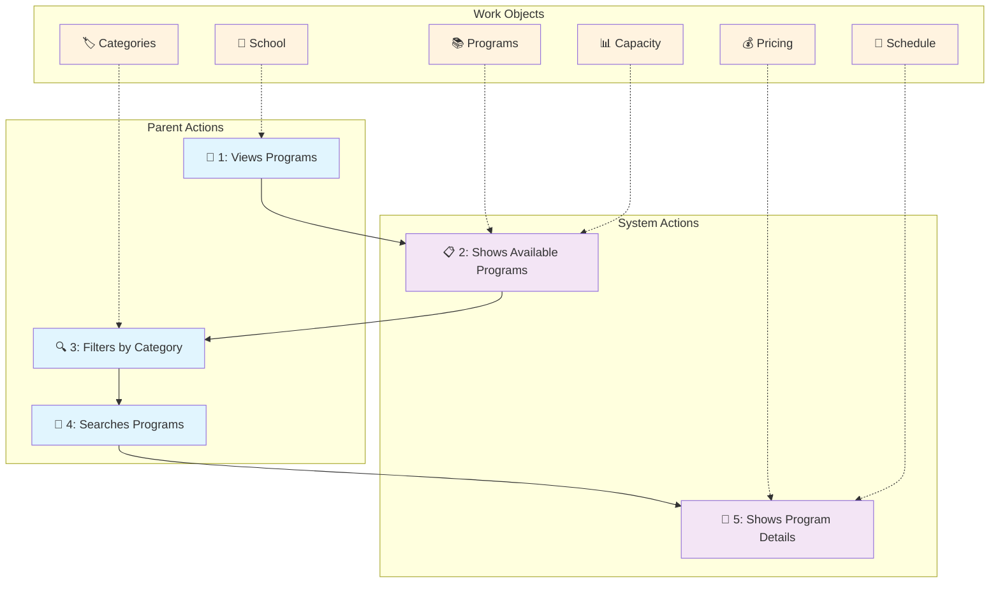

# Prime Youth Domain Stories
*Business Domain Analysis using Domain Storytelling*

## Overview

This document captures the core business domain stories for Prime Youth, focusing on how parents, children, and the system interact during the program discovery and enrollment process. These stories form the foundation for understanding our business domain without getting into technical implementation details.

## Domain Stories

Based on the booking flow and user journey analysis, here are the key domain stories:

### Story 1: Parent Program Discovery
**Actors:** Parent, System, School
**Narrative:** Parent [views] Programs at their child's School → System [displays] available Programs with capacity indicators → Parent [filters] Programs by category → Parent [searches] specific Program types → System [shows] Program details with pricing and schedules

**Work Objects:** Programs, School, Categories, Capacity, Pricing, Schedule

### Story 2: Program Enrollment
**Actors:** Parent, Child, Program, Payment System
**Narrative:** Parent [selects] Program for Child → System [shows] Program details with reviews → Parent [clicks] "Enroll Now" → System [displays] enrollment form with Child selection → Parent [fills] special requirements → System [calculates] total cost → Parent [completes] enrollment with Payment → System [confirms] enrollment

**Work Objects:** Program, Child, Reviews, EnrollmentForm, SpecialRequirements, Payment, Enrollment

### Story 3: Family Progress Tracking
**Actors:** Parent, Children, System, Achievements
**Narrative:** Parent [opens] dashboard → System [displays] Children's progress → System [shows] session counts and achievements → System [calculates] family milestones → Parent [views] next recommended programs

**Work Objects:** Children, Progress, Sessions, Achievements, Milestones, Recommendations

## Visual Domain Story: Parent Program Discovery

Here's the visual representation of our first domain story using Mermaid:

**Visual Elements:**

- **Blue Boxes**: Parent-initiated activities
- **Purple Boxes**: System responses and processing
- **Orange Boxes**: Work objects (domain entities)
- **Solid arrows (→)**: Activity sequence flow
- **Dotted arrows (-.->)**: Work object involvement
- **Numbers (1-5)**: Story progression sequence

**Work Objects in the Story:**

- **School** 🏫: Context for program discovery - represents the educational institution
- **Programs** 📚: Core domain entity being discovered - the activities/courses offered
- **Categories** 🏷️: Classification system for filtering programs (Arts, Sports, Music, etc.)
- **Capacity** 📊: Availability information - how many spots are available vs enrolled
- **Pricing** 💰: Cost information - weekly fees, registration costs, total amounts
- **Schedule** 📅: Time-based details - days, times, duration, start/end dates

**Domain Storytelling Elements:**

1. **Actors**: Parent (initiator) and System (responder) with clear role separation
2. **Activities**: Views, Filters, Searches, Shows - each representing a specific interaction
3. **Work Objects**: Domain entities that flow through the activities and get transformed
4. **Sequential Flow**: Numbered progression showing the narrative from start to finish
5. **Object Involvement**: Dotted lines show which domain entities participate in each activity

This visual representation eliminates rendering issues while maintaining the core domain storytelling structure, making it easy for both technical and non-technical stakeholders to understand the business flow.

## Key Business Concepts

### Programs
The central concept in our domain - represents afterschool activities, camps, or class trips that children can enroll in.

### Enrollment
The process by which a parent registers their child for a specific program, including payment and special requirements.

### Family Progress
The ongoing tracking of children's participation, achievements, and milestones across multiple programs and sessions.

### Capacity Management
How the system tracks and displays program availability to ensure proper enrollment limits.

## Next Steps for Domain Evolution

1. **Expand Story 2 and 3**: Create detailed visual diagrams for Program Enrollment and Family Progress Tracking
2. **Add Edge Cases**: Document what happens when programs are full, payments fail, or children need to withdraw
3. **Seasonal Patterns**: Understand how summer camps vs school-year programs differ in the domain
4. **Multi-School Scenarios**: How families with children in different schools navigate the system
5. **Instructor Perspective**: Add domain stories from the instructor/administrator point of view

---

*For technical implementation details, see [technical-architecture.md](./technical-architecture.md)*