# Prime Youth Domain Stories
*Business Domain Analysis using Domain Storytelling*

## Overview

This document captures the core business domain stories for Prime Youth using visual domain storytelling. These diagrams show how parents, children, and the system interact during program discovery, enrollment, and progress tracking, forming the foundation for understanding our business domain without technical implementation details.

## Domain Summary

### Actors
- **👨‍👩‍👧‍👦 Parent**: Primary user who discovers programs, enrolls children, and tracks progress
- **👶 Child/Children**: Program participants whose progress and enrollment are managed
- **🖥️ System**: Platform that processes requests, displays information, and manages data
- **🏫 School**: Educational institution context for program discovery
- **💳 Payment System**: Handles enrollment payments and financial transactions
- **🏆 Achievements**: System that tracks and awards progress milestones

### Work Objects
**Program Management**
- **📚 Programs**: Core domain entity - afterschool activities, camps, class trips
- **🏷️ Categories**: Classification system (Arts, Sports, Music, etc.)
- **📊 Capacity**: Availability tracking - enrolled vs available spots
- **💰 Pricing**: Cost information - fees, registration costs, totals
- **📅 Schedule**: Time details - days, duration, start/end dates

**Enrollment Process**
- **👶 Child**: Individual participant being enrolled
- **⭐ Reviews**: Program feedback and ratings from other families
- **📝 EnrollmentForm**: Registration interface with child selection
- **📋 SpecialRequirements**: Individual needs and accommodations
- **💳 Payment**: Financial transaction for program enrollment
- **✅ Enrollment**: Completed registration confirmation

**Progress Tracking**
- **📈 Progress**: Individual child advancement and participation data
- **📊 Sessions**: Attendance and participation records
- **🏆 Achievements**: Earned badges, certificates, and milestones
- **🎯 Milestones**: Family-level progress indicators across programs
- **💡 Recommendations**: System-suggested next programs based on history

### Key Activities
1. **Discovery**: Parents explore and filter available programs by school and category
2. **Enrollment**: Parents register children with special requirements and payment
3. **Tracking**: System monitors progress and suggests next steps for family growth

## Visual Domain Stories

## Visual Domain Story: Parent Program Discovery

Here's the visual representation of our first domain story using Mermaid:

```mermaid
graph TD
    subgraph ParentActions[Parent Actions]
        P1[👀 1: Views Programs]
        P2[🔍 3: Filters by Category]
        P3[🔎 4: Searches Programs]
    end

    subgraph SystemActions[System Actions]
        S1[📋 2: Shows Available Programs]
        S2[📄 5: Shows Program Details]
    end

    subgraph WorkObjects[Work Objects]
        WO1[🏫 School]
        WO2[📚 Programs]
        WO3[🏷️ Categories]
        WO4[📊 Capacity]
        WO5[💰 Pricing]
        WO6[📅 Schedule]
    end

    P1 --> S1
    S1 --> P2
    P2 --> P3
    P3 --> S2

    WO1 -.-> P1
    WO2 -.-> S1
    WO3 -.-> P2
    WO4 -.-> S1
    WO5 -.-> S2
    WO6 -.-> S2

    classDef parentStyle fill:#e1f5fe
    classDef systemStyle fill:#f3e5f5
    classDef workObjectStyle fill:#fff3e0

    class P1,P2,P3 parentStyle
    class S1,S2 systemStyle
    class WO1,WO2,WO3,WO4,WO5,WO6 workObjectStyle
```

**Visual Elements:**

- **Blue Boxes**: Parent-initiated activities
- **Purple Boxes**: System responses and processing
- **Orange Boxes**: Work objects (domain entities)
- **Solid arrows (→)**: Activity sequence flow
- **Dotted arrows (-.->)**: Work object involvement
- **Numbers (1-5)**: Story progression sequence

**Work Objects in the Story:**

- **School** 🏫: Context for program discovery - represents the educational institution
- **Programs** 📚: Core domain entity being discovered - the activities/courses offered
- **Categories** 🏷️: Classification system for filtering programs (Arts, Sports, Music, etc.)
- **Capacity** 📊: Availability information - how many spots are available vs enrolled
- **Pricing** 💰: Cost information - weekly fees, registration costs, total amounts
- **Schedule** 📅: Time-based details - days, times, duration, start/end dates

**Domain Storytelling Elements:**

1. **Actors**: Parent (initiator) and System (responder) with clear role separation
2. **Activities**: Views, Filters, Searches, Shows - each representing a specific interaction
3. **Work Objects**: Domain entities that flow through the activities and get transformed
4. **Sequential Flow**: Numbered progression showing the narrative from start to finish
5. **Object Involvement**: Dotted lines show which domain entities participate in each activity

This visual representation eliminates rendering issues while maintaining the core domain storytelling structure, making it easy for both technical and non-technical stakeholders to understand the business flow.

## Visual Domain Story: Program Enrollment

Here's the visual representation of the program enrollment process using Mermaid:

```mermaid
graph TD
    subgraph ParentActions[Parent Actions]
        P1[👀 1: Selects Program]
        P2[🖱️ 3: Clicks 'Enroll Now']
        P3[✏️ 5: Fills Special Requirements]
        P4[💳 7: Completes Payment]
    end

    subgraph SystemActions[System Actions]
        S1[📄 2: Shows Program Details]
        S2[📝 4: Displays Enrollment Form]
        S3[🧮 6: Calculates Total Cost]
        S4[✅ 8: Confirms Enrollment]
    end

    subgraph WorkObjects[Work Objects]
        WO1[📚 Program]
        WO2[👶 Child]
        WO3[⭐ Reviews]
        WO4[📝 EnrollmentForm]
        WO5[📋 SpecialRequirements]
        WO6[💳 Payment]
        WO7[✅ Enrollment]
    end

    P1 --> S1
    S1 --> P2
    P2 --> S2
    S2 --> P3
    P3 --> S3
    S3 --> P4
    P4 --> S4

    WO1 -.-> P1
    WO2 -.-> S2
    WO3 -.-> S1
    WO4 -.-> S2
    WO5 -.-> P3
    WO6 -.-> P4
    WO7 -.-> S4

    classDef parentStyle fill:#e1f5fe
    classDef systemStyle fill:#f3e5f5
    classDef workObjectStyle fill:#fff3e0

    class P1,P2,P3,P4 parentStyle
    class S1,S2,S3,S4 systemStyle
    class WO1,WO2,WO3,WO4,WO5,WO6,WO7 workObjectStyle
```

**Visual Elements:**

- **Blue Boxes**: Parent-initiated enrollment activities
- **Purple Boxes**: System responses and processing during enrollment
- **Orange Boxes**: Work objects (domain entities) involved in enrollment
- **Solid arrows (→)**: Enrollment sequence flow (8 steps total)
- **Dotted arrows (-.->)**: Work object involvement in each step
- **Numbers (1-8)**: Sequential progression through enrollment process

## Visual Domain Story: Family Progress Tracking

Here's the visual representation of the family progress tracking process using Mermaid:

```mermaid
graph TD
    subgraph ParentActions[Parent Actions]
        P1[📱 1: Opens Dashboard]
        P2[👀 5: Views Recommendations]
    end

    subgraph SystemActions[System Actions]
        S1[📊 2: Displays Children's Progress]
        S2[📈 3: Shows Session Counts]
        S3[🏆 4: Shows Achievements]
        S4[🎯 4: Calculates Milestones]
    end

    subgraph WorkObjects[Work Objects]
        WO1[👶 Children]
        WO2[📈 Progress]
        WO3[📊 Sessions]
        WO4[🏆 Achievements]
        WO5[🎯 Milestones]
        WO6[💡 Recommendations]
    end

    P1 --> S1
    S1 --> S2
    S2 --> S3
    S3 --> S4
    S4 --> P2

    WO1 -.-> S1
    WO2 -.-> S1
    WO3 -.-> S2
    WO4 -.-> S3
    WO5 -.-> S4
    WO6 -.-> P2

    classDef parentStyle fill:#e1f5fe
    classDef systemStyle fill:#f3e5f5
    classDef workObjectStyle fill:#fff3e0

    class P1,P2 parentStyle
    class S1,S2,S3,S4 systemStyle
    class WO1,WO2,WO3,WO4,WO5,WO6 workObjectStyle
```

**Visual Elements:**

- **Blue Boxes**: Parent-initiated tracking activities
- **Purple Boxes**: System data processing and presentation
- **Orange Boxes**: Work objects (domain entities) involved in progress tracking
- **Solid arrows (→)**: Progress tracking sequence flow (5 steps total)
- **Dotted arrows (-.->)**: Work object involvement in each step
- **Numbers (1-5)**: Sequential progression through progress review

## Next Steps for Domain Evolution

1. **Add Edge Cases**: Document what happens when programs are full, payments fail, or children need to withdraw
2. **Multi-School Scenarios**: How families with children in different schools navigate the system
3. **Instructor Perspective**: Add domain stories from the instructor/administrator point of view
4. **Administrative Workflows**: Model how administrators manage programs, capacity, and enrollment reporting

---

*For technical implementation details, see [technical-architecture.md](./technical-architecture.md)*