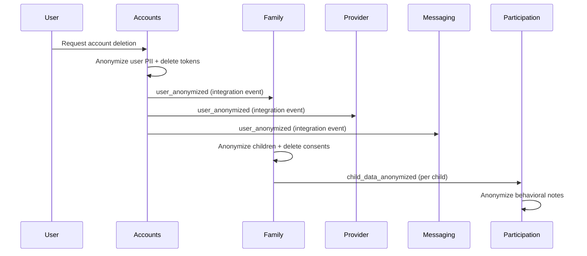

# Flow: GDPR User Deletion

> When a user requests account deletion, the system anonymizes their personal data across all bounded contexts in a coordinated cascade, ensuring GDPR compliance while preserving non-personal records for audit.

## Trigger

A user requests account deletion from their settings page. The Accounts context anonymizes the user record and publishes a `user_anonymized` event that cascades through all contexts that hold personal data.

## Contexts Involved

| Context | Role in Flow |
|---|---|
| **Accounts** | Initiator — anonymizes user PII (email, name, password hash), deletes tokens, publishes `user_anonymized` |
| **Family** | Anonymizes all children's PII (names, DOB, emergency contact, support needs, allergies), deletes consent records, publishes `child_data_anonymized` per child |
| **Provider** | No-op — provider profiles retain `business_name` for audit purposes (no PII to anonymize) |
| **Messaging** | Anonymizes message content to `[deleted]`, marks conversation participations as left |
| **Participation** | Anonymizes behavioral notes for each child (replaces content, sets status to rejected, clears rejection reasons) |

## Flow

## Data Exchanged

| Boundary Crossing | Data | Format |
|---|---|---|
| Accounts -> Family, Provider, Messaging | `user_id`, `previous_email`, `anonymized_at` | Integration event via PubSub |
| Family -> Participation | `child_id` | Integration event via PubSub (one per child, marked `:critical`) |

## Failure Modes

| Step | Failure | What Happens |
|---|---|---|
| Accounts anonymize user | DB update fails | Returns `{:error, changeset}` — user is not anonymized, no events published |
| Accounts dispatch `user_anonymized` | Event dispatch fails | Logged at error level; primary anonymization still succeeded but downstream contexts are not notified. Manual intervention needed. |
| Family anonymize children | DB error on any child | Cascade halts at that child (`reduce_while`). Earlier children are already anonymized. Returns error to caller. |
| Family publish `child_data_anonymized` | PubSub publish fails | Cascade halts — the GDPR anonymization is critical, so publish failure stops further processing |
| Provider handle `user_anonymized` | N/A | No-op by design — always returns `:ok` |
| Messaging anonymize data | DB error | Retried once with 100ms backoff. On permanent failure, error is logged and returned |
| Participation anonymize notes | DB error | Retried once with 100ms backoff. On permanent failure, error is logged and returned |

---

*Generated from code. Sections marked `[NEEDS INPUT]` require manual review.*
