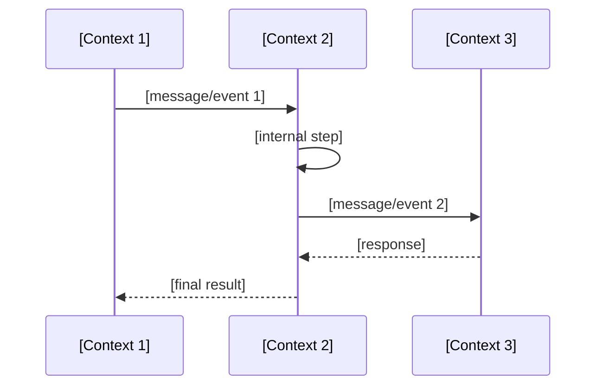

# Flow: [Scenario Name]

> [1-2 sentence summary of the end-to-end flow.]

## Trigger

[What kicks off this flow — user action, scheduled event, external webhook, etc.]

## Contexts Involved

| Context | Role in Flow |
|---|---|
| [Context 1] | [What it does in this flow] |
| [Context 2] | [What it does in this flow] |
| [Context 3] | [What it does in this flow] |

## Flow

## Data Exchanged

| Boundary Crossing | Data | Format |
|---|---|---|
| [Context 1] -> [Context 2] | [what data crosses] | [event / direct call / shared ID] |
| [Context 2] -> [Context 3] | [what data crosses] | [event / direct call / shared ID] |

## Failure Modes

| Step | Failure | What Happens |
|---|---|---|
| [Step description] | [What can go wrong] | [How the system handles it] |

---

*Generated from code. Sections marked `[NEEDS INPUT]` require manual review.*
