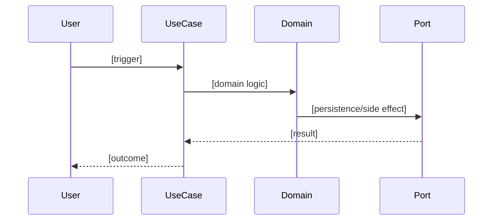

# Feature: [Feature Name]

> **Context:** [Context Name] | **Status:** Active | Planned | Stub
> **Last verified:** [commit SHA]

## Purpose

[1-2 sentences. What does this feature do for the user? Write as if explaining to someone who has never seen the code.]

## What It Does

- [Capability 1]
- [Capability 2]
- [Capability 3]

## What It Does NOT Do

| Out of Scope | Handled By |
|---|---|
| [Thing this feature explicitly doesn't do] | [Context/feature that handles it] |

## Business Rules

```
GIVEN [precondition]
WHEN  [action or trigger]
THEN  [expected outcome]
```

```
GIVEN [precondition]
WHEN  [action or trigger]
THEN  [expected outcome]
```

## How It Works



## Dependencies

| Direction | Context | What |
|---|---|---|
| Requires | [Other Context] | [What this feature needs from it] |
| Provides to | [Other Context] | [What this feature supplies] |

## Edge Cases

- [Edge case 1 and how it's handled]
- [Edge case 2 and how it's handled]

## Roles & Permissions

| Role | Can Do | Cannot Do |
|---|---|---|
| Parent | [allowed actions] | [restricted actions] |
| Provider | [allowed actions] | [restricted actions] |
| Admin | [allowed actions] | [restricted actions] |

---

*Generated from code. Sections marked `[NEEDS INPUT]` require manual review.*
